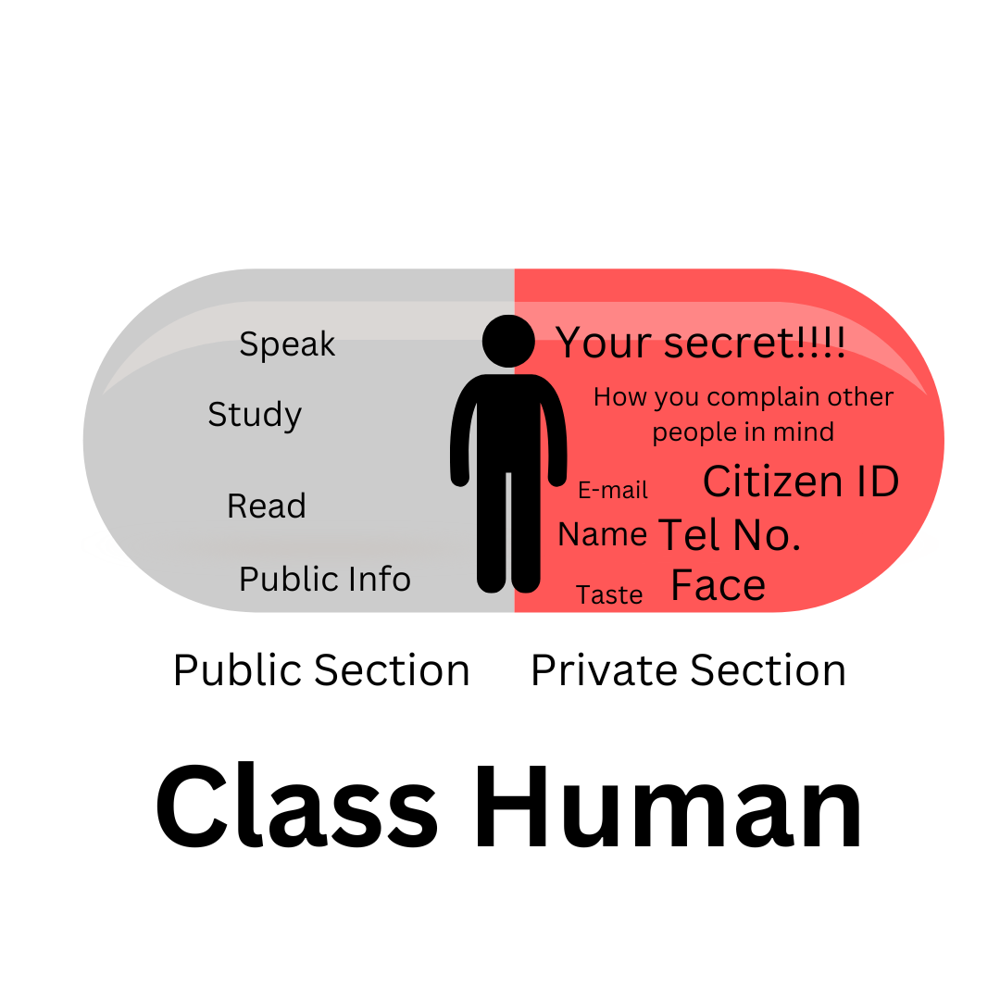

# Object-Oriented Programming
There are 6 main concepts of object-oriented programming:

1. [Object](#1-object)
2. [Class](#2-class)
3. [Encapsulation](#3-encapsulation)
4. [Inheritance](#4-inheritance)
5. [Polymorphism](#5-polymorphism)
6. [Abstraction](#6-abstraction)

## 1. Object
Object is a group of related state and behavior, explained by the concept of real-world objects, for example, animal, rock, pencil, bicycle, etc. 

An object has two characteristic:
1. State/Field (Variable and static value) 
2. Behavior (Method) - The action that the object can act

**Example 1: Animal**

State: name, age, phylum

Behavior: eat, sleep

**Example 2: Car**

State: speed, velocity, left light(on/off), right light(on/off)

Behavior: turn left, turn right, change speed, change velocity, brake

## 2. Class

Class is the blueprint or prototype for creating object, priscribing what object will have and can act after it is created. 

```Java
public class Animal {
    //These are state of object.
    String name;
    int age;
    String phylum;

    //These are behavior.
    void eat();

    void sleep();
}
```

To create an instance of object, we use `new` keyword.

e.g.
```Java
    // Class_name instace_name = new class_name(); 
    Animal animal1 = new Animal();
```
In the code above:
- `Animal` is the class name.
- `animal1` is the instance name.
- `new` is keyword for creating a new instance of object.
- `Animal()` is the constructor method for creating an instance.

> [!NOTE]
> All function which is in java class is called "method". 


**Constructor** is the special method for creating a new instance. The method must have the same name of its class.

e.g. Method `Car` in class `Car` is the constructor,    
```Java
public class Car {
    float speed;
    float acceleration;

    public Car(float speed, float acceleration)
    {
        this.speed = speed;
        this.acceleration = acceleration;
    }
}
```
> [!NOTE]
> `this` keyword is used to refer to the current object (any instance), avoid changing in the prototype. 

When we have parameters in constructor method, we need to add the satisfying parameter, otherwise the error is coming. 

e.g. Using `Car` class as the prototype
```Java
    Car car1 = new Car(10, 0);

    //This one will catch err.
    Car car2 = new Car();
```

According to the constructor,

- `10` is satisfying `speed`.

- `0` is satisfying `velocity`.

If we want to add multiple pattern of parameter, for example:

Car No.1 no need to put any parameter (auto set to 0).

Car No.2 only put the speed.

Car No.3 put all information according the objject's state.

Like the code below:

```Java
Car car1 = new Car();
Car car2 = new Car(10);
Car car3 = new Car(10, 5);
```
**Constructor can be in the same class more than one.**

e.g.
```Java
public class Car {
    float speed;
    float acceleration;

    public Car() 
    {
        this.speed = 0;
        this.acceleration = 0;
    }

    public Car(float speed)
    {
        this.speed = speed;
        this.acceleration = 0;
    }

    public Car(float speed, float acceleration)
    {
        this.speed = speed;
        this.acceleration = acceleration;
    }
}
```
> [!WARNING]
> If the two constructors have same number of parameter, parameter types must not be the same.
> The program will be error as duplicating the method following code below.
> ```Java
>   //Error case 
>   public Car(float speed)
>   {
>       //Do smth
>   }
>   public Car(float acceleration)
>   {
>       //Do smth
>   }
> ``` 
> If the data type of parameter is not the same, it still works!
> ```Java
>   //Good case 
>   public Car(String name)
>   {
>       //Do smth
>   }
>   public Car(float acceleration)
>   {
>       //Do smth
>   }
>```

Example Code: 00Car [here](./00Car/src/)

## 3. Encapsulation
Object always has sides which we cannot see, for example, ourselves have secrets or faces that we do not want others to see.

This is the example for encapsulation.



Mostly, we use this concept to cover the secret like personal infomation.

There are 3 modifiers that control the accessibily; `public`, `protected` and `private`, used with class, variable and method.

### Access Levels
|Modifier   |Class     |Package      |Subclass     |World        |
|-----------|----------|-------------|-------------|-------------|
|`public`   |Can Access|Can Access   |Can Access   |Can Access   |
|`protected`|Can Access|Can Access   |Can Access   |Cannot Access|
|no modifier|Can Access|Can Access   |Cannot Access|Cannot Access|
|`private`  |Can Access|Cannot Access|Cannot Access|Cannot Access|

`public`: everywhere, every person can access.

`protected`: can access in its class, package and subclass/[childclass](#4-inheritance) .

***no modifier*** e.g. `class App`: Only inside its package(folder). It is also called ***package private***. 

`private`: only inside the class, other classes cannot access.

Example Code Explanation: [02-ScopeEncapsulation](../02-ScopeEncapsulation/src)

```bash
.
├── App.class
├── App.java
└── data
    ├── ManagePerson.java
    ├── Person.java
    └── Programmer.java
```

For example, code in Person.java
```Java
//Tell that class in data directory.
package data;

public class Person {
    
    private String name;
    private int age;

    public Person(String name, int age) {
        this.name = name;
        this.age = age;
    }

    protected void setName(String name)
    {
        this.name =  name;
    }

    protected void setAge(int age)
    {
        this.age = age;
    }

    protected String getName()
    {
        return this.name;
    }
}
```
1. `name` and `age` are ***private***, so only its class's members (`Person`, `setName`, `setAge`, `getName`) can access. Other classes cannot access.
2. `getName`, `setAge` and `setName` are ***protected***. If you use those method in `App` class, it will traffic an error. If you use in `ManagePerson`, it will work because it is in the same directory/folder(`data`).
3. `Person` is ***public***, so it can work everywhere.

For more example usage, please see in [inheritance](#4-inheritance) and [polymorphism](#5-polymorphism).

## 4. Inheritance

## 5. Polymorphism

## 6. Abstraction
